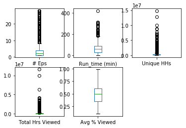
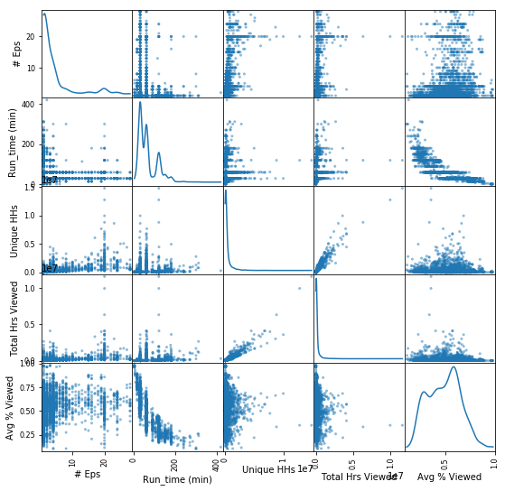
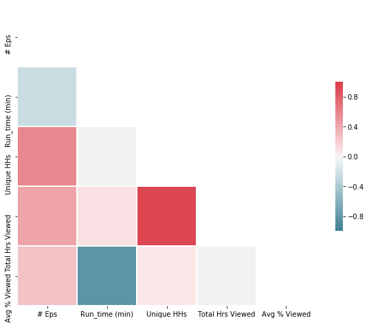
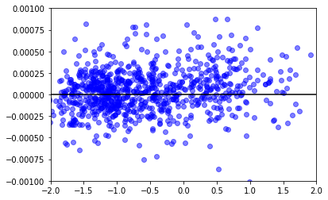

```python
import numpy as np 
import pandas as pd 
from sklearn.preprocessing import StandardScaler
from sklearn.linear_model import LinearRegression
from sklearn.metrics import r2_score
from sklearn.metrics import mean_squared_error
from sklearn.metrics import r2_score
import matplotlib.pyplot as plt 
import seaborn as sns
from pandas.plotting import scatter_matrix
```


```python
### Explore Data Analysis
```


```python
data=pd.read_excel("TV-data.xlsx") # Upload the data
```


```python
data.head() # Display the data
```


<div>
<style scoped>
    .dataframe tbody tr th:only-of-type {
        vertical-align: middle;
    }

    .dataframe tbody tr th {
        vertical-align: top;
    }

    .dataframe thead th {
        text-align: right;
    }
</style>
<table border="1" class="dataframe">
  <thead>
    <tr style="text-align: right;">
      <th></th>
      <th>series</th>
      <th>network</th>
      <th>Type</th>
      <th># Eps</th>
      <th>Air Day</th>
      <th>National Time</th>
      <th>daypart</th>
      <th>Run_time (min)</th>
      <th>Unique HHs</th>
      <th>Total Hrs Viewed</th>
      <th>Avg % Viewed</th>
    </tr>
  </thead>
  <tbody>
    <tr>
      <th>0</th>
      <td>series19</td>
      <td>network4</td>
      <td>Broadcast</td>
      <td>1</td>
      <td>M</td>
      <td>2011-04-04 21:00:00</td>
      <td>prime</td>
      <td>177.00</td>
      <td>2006831</td>
      <td>2.133483e+06</td>
      <td>0.293022</td>
    </tr>
    <tr>
      <th>1</th>
      <td>series314</td>
      <td>network5</td>
      <td>Broadcast</td>
      <td>3</td>
      <td>M</td>
      <td>2011-04-11 20:00:00</td>
      <td>prime</td>
      <td>121.00</td>
      <td>4473165</td>
      <td>4.094865e+06</td>
      <td>0.397506</td>
    </tr>
    <tr>
      <th>2</th>
      <td>series314</td>
      <td>network5</td>
      <td>Broadcast</td>
      <td>1</td>
      <td>M</td>
      <td>2011-04-18 20:00:00</td>
      <td>prime</td>
      <td>91.00</td>
      <td>1221582</td>
      <td>9.647431e+05</td>
      <td>0.468066</td>
    </tr>
    <tr>
      <th>3</th>
      <td>series19</td>
      <td>network4</td>
      <td>Broadcast</td>
      <td>1</td>
      <td>S</td>
      <td>2011-04-02 20:30:00</td>
      <td>prime</td>
      <td>178.00</td>
      <td>1599092</td>
      <td>1.767497e+06</td>
      <td>0.313271</td>
    </tr>
    <tr>
      <th>4</th>
      <td>series83</td>
      <td>network18</td>
      <td>Broadcast</td>
      <td>4</td>
      <td>R</td>
      <td>2011-04-21 20:00:00</td>
      <td>prime</td>
      <td>60.25</td>
      <td>3829201</td>
      <td>2.390739e+06</td>
      <td>0.567840</td>
    </tr>
  </tbody>
</table>
</div>


```python
data.shape # There are 3500 rows and 11 columns
```


    (3500, 11)


```python
data.ndim # Dimensions are two
```


    2


```python
data.duplicated().sum() # There is no duplicated rows
```


    0


```python
data.isnull().sum() # No missing/NaN values in the dataset
```


    series              0
    network             0
    Type                0
    # Eps               0
    Air Day             0
    National Time       0
    daypart             0
    Run_time (min)      0
    Unique HHs          0
    Total Hrs Viewed    0
    Avg % Viewed        0
    dtype: int64


```python
data.dtypes # Check data types of each column
```


    series               object
    network              object
    Type                 object
    # Eps                 int64
    Air Day              object
    National Time        object
    daypart              object
    Run_time (min)      float64
    Unique HHs            int64
    Total Hrs Viewed    float64
    Avg % Viewed        float64
    dtype: object


```python
data.describe() # Get basic statistics
```


<div>
<style scoped>
    .dataframe tbody tr th:only-of-type {
        vertical-align: middle;
    }

    .dataframe tbody tr th {
        vertical-align: top;
    }

    .dataframe thead th {
        text-align: right;
    }
</style>
<table border="1" class="dataframe">
  <thead>
    <tr style="text-align: right;">
      <th></th>
      <th># Eps</th>
      <th>Run_time (min)</th>
      <th>Unique HHs</th>
      <th>Total Hrs Viewed</th>
      <th>Avg % Viewed</th>
    </tr>
  </thead>
  <tbody>
    <tr>
      <th>count</th>
      <td>3500.000000</td>
      <td>3500.000000</td>
      <td>3.500000e+03</td>
      <td>3.500000e+03</td>
      <td>3500.000000</td>
    </tr>
    <tr>
      <th>mean</th>
      <td>4.098857</td>
      <td>65.611550</td>
      <td>3.716375e+05</td>
      <td>1.690007e+05</td>
      <td>0.484845</td>
    </tr>
    <tr>
      <th>std</th>
      <td>5.664574</td>
      <td>46.158333</td>
      <td>7.660410e+05</td>
      <td>4.385123e+05</td>
      <td>0.165962</td>
    </tr>
    <tr>
      <th>min</th>
      <td>1.000000</td>
      <td>2.000000</td>
      <td>1.286500e+04</td>
      <td>6.268061e+02</td>
      <td>0.101760</td>
    </tr>
    <tr>
      <th>25%</th>
      <td>1.000000</td>
      <td>30.000000</td>
      <td>6.796900e+04</td>
      <td>2.809981e+04</td>
      <td>0.350000</td>
    </tr>
    <tr>
      <th>50%</th>
      <td>2.000000</td>
      <td>60.000000</td>
      <td>1.393025e+05</td>
      <td>6.294667e+04</td>
      <td>0.495075</td>
    </tr>
    <tr>
      <th>75%</th>
      <td>4.000000</td>
      <td>90.000000</td>
      <td>3.331402e+05</td>
      <td>1.347992e+05</td>
      <td>0.605277</td>
    </tr>
    <tr>
      <th>max</th>
      <td>28.000000</td>
      <td>420.000000</td>
      <td>1.478116e+07</td>
      <td>1.155655e+07</td>
      <td>0.983699</td>
    </tr>
  </tbody>
</table>
</div>


```python
data.describe(include=['object']) 
```


<div>
<style scoped>
    .dataframe tbody tr th:only-of-type {
        vertical-align: middle;
    }

    .dataframe tbody tr th {
        vertical-align: top;
    }

    .dataframe thead th {
        text-align: right;
    }
</style>
<table border="1" class="dataframe">
  <thead>
    <tr style="text-align: right;">
      <th></th>
      <th>series</th>
      <th>network</th>
      <th>Type</th>
      <th>Air Day</th>
      <th>National Time</th>
      <th>daypart</th>
    </tr>
  </thead>
  <tbody>
    <tr>
      <th>count</th>
      <td>3500</td>
      <td>3500</td>
      <td>3500</td>
      <td>3500</td>
      <td>3500</td>
      <td>3500</td>
    </tr>
    <tr>
      <th>unique</th>
      <td>1441</td>
      <td>69</td>
      <td>2</td>
      <td>87</td>
      <td>1039</td>
      <td>7</td>
    </tr>
    <tr>
      <th>top</th>
      <td>series1062</td>
      <td>network26</td>
      <td>Cable</td>
      <td>S</td>
      <td>13:00:00</td>
      <td>earlymorning</td>
    </tr>
    <tr>
      <th>freq</th>
      <td>37</td>
      <td>241</td>
      <td>3119</td>
      <td>737</td>
      <td>66</td>
      <td>500</td>
    </tr>
  </tbody>
</table>
</div>


```python
data_df= pd.DataFrame(data)# Create a DataFrame
```


```python
### Visualization before Modeling
```


```python
## Boxplot
data_df.plot(kind='box', subplots=True, layout=(2,3), sharex=False, sharey=False)
plt.show() # Create boxplot to check outliers
```





```python
## Scatter Matrix plot 
scatter_matrix(data_df,figsize=(9, 9),diagonal='kde')
plt.show()
```





Some relationships such as strong linear correlations can be observed from above scatter matrix plot:
1) A positive correlation between 'Total Hrs Viewed' and 'Unique HHs'. 
2) A negative correlation between 'Avg % Viewed' and 'Run_time(mins)'. 


```python
## Correlation Matrix and diagonal correlation matrix plot

# Compute the correlation matrix
nudata=data_df.drop(columns=['series','network','Type','Air Day','National Time','daypart'])
corr = nudata.corr()
corr
```


<div>
<style scoped>
    .dataframe tbody tr th:only-of-type {
        vertical-align: middle;
    }

    .dataframe tbody tr th {
        vertical-align: top;
    }

    .dataframe thead th {
        text-align: right;
    }
</style>
<table border="1" class="dataframe">
  <thead>
    <tr style="text-align: right;">
      <th></th>
      <th># Eps</th>
      <th>Run_time (min)</th>
      <th>Unique HHs</th>
      <th>Total Hrs Viewed</th>
      <th>Avg % Viewed</th>
    </tr>
  </thead>
  <tbody>
    <tr>
      <th># Eps</th>
      <td>1.000000</td>
      <td>-0.249391</td>
      <td>0.585050</td>
      <td>0.427806</td>
      <td>0.258269</td>
    </tr>
    <tr>
      <th>Run_time (min)</th>
      <td>-0.249391</td>
      <td>1.000000</td>
      <td>-0.037626</td>
      <td>0.089791</td>
      <td>-0.827610</td>
    </tr>
    <tr>
      <th>Unique HHs</th>
      <td>0.585050</td>
      <td>-0.037626</td>
      <td>1.000000</td>
      <td>0.936409</td>
      <td>0.069290</td>
    </tr>
    <tr>
      <th>Total Hrs Viewed</th>
      <td>0.427806</td>
      <td>0.089791</td>
      <td>0.936409</td>
      <td>1.000000</td>
      <td>-0.022596</td>
    </tr>
    <tr>
      <th>Avg % Viewed</th>
      <td>0.258269</td>
      <td>-0.827610</td>
      <td>0.069290</td>
      <td>-0.022596</td>
      <td>1.000000</td>
    </tr>
  </tbody>
</table>
</div>


From this correlation matrix, it is confirmed that there is an obvious negative correlation between average % of the program viewed and its runing time, with a correaltion of -0.827610. There is a strong positive correlation +0.936409, between total hours viewed and the number of unique households tuned in to a given series within given time interval.


```python
# Generate a mask for the upper triangle
mask = np.zeros_like(corr, dtype=np.bool)
mask[np.triu_indices_from(mask)] = True

# Set up the matplotlib figure
f, ax = plt.subplots(figsize=(10, 8))

# Generate a custom diverging colormap
cmap = sns.diverging_palette(220, 10, as_cmap=True)

# Draw the heatmap with the mask and correct aspect ratio
sns.heatmap(corr, mask=mask, cmap=cmap, vmax=1.0, vmin=-1.0, center=0,
            square=True, linewidths=.5, cbar_kws={"shrink": .5})
```


    <matplotlib.axes._subplots.AxesSubplot at 0x1a22d510b8>





A diagonal correlation matrix could be plotted to vividly show the result.


```python
### Data Modeling
```


```python
## Data Preprocessing

# Normalization
cols_to_norm = ['# Eps','Run_time (min)','Unique HHs','Total Hrs Viewed','Avg % Viewed']
data_df[cols_to_norm] = StandardScaler().fit_transform(data_df[cols_to_norm])
```


```python
data_df.head() # Show the dataframe after normalization
```


<div>
<style scoped>
    .dataframe tbody tr th:only-of-type {
        vertical-align: middle;
    }

    .dataframe tbody tr th {
        vertical-align: top;
    }

    .dataframe thead th {
        text-align: right;
    }
</style>
<table border="1" class="dataframe">
  <thead>
    <tr style="text-align: right;">
      <th></th>
      <th>series</th>
      <th>network</th>
      <th>Type</th>
      <th># Eps</th>
      <th>Air Day</th>
      <th>National Time</th>
      <th>daypart</th>
      <th>Run_time (min)</th>
      <th>Unique HHs</th>
      <th>Total Hrs Viewed</th>
      <th>Avg % Viewed</th>
    </tr>
  </thead>
  <tbody>
    <tr>
      <th>0</th>
      <td>series19</td>
      <td>network4</td>
      <td>Broadcast</td>
      <td>-0.547137</td>
      <td>M</td>
      <td>2011-04-04 21:00:00</td>
      <td>prime</td>
      <td>2.413527</td>
      <td>2.134908</td>
      <td>4.480520</td>
      <td>-1.155990</td>
    </tr>
    <tr>
      <th>1</th>
      <td>series314</td>
      <td>network5</td>
      <td>Broadcast</td>
      <td>-0.194015</td>
      <td>M</td>
      <td>2011-04-11 20:00:00</td>
      <td>prime</td>
      <td>1.200138</td>
      <td>5.354953</td>
      <td>8.953969</td>
      <td>-0.526335</td>
    </tr>
    <tr>
      <th>2</th>
      <td>series314</td>
      <td>network5</td>
      <td>Broadcast</td>
      <td>-0.547137</td>
      <td>M</td>
      <td>2011-04-18 20:00:00</td>
      <td>prime</td>
      <td>0.550108</td>
      <td>1.109687</td>
      <td>1.814900</td>
      <td>-0.101115</td>
    </tr>
    <tr>
      <th>3</th>
      <td>series19</td>
      <td>network4</td>
      <td>Broadcast</td>
      <td>-0.547137</td>
      <td>S</td>
      <td>2011-04-02 20:30:00</td>
      <td>prime</td>
      <td>2.435194</td>
      <td>1.602564</td>
      <td>3.645793</td>
      <td>-1.033963</td>
    </tr>
    <tr>
      <th>4</th>
      <td>series83</td>
      <td>network18</td>
      <td>Broadcast</td>
      <td>-0.017454</td>
      <td>R</td>
      <td>2011-04-21 20:00:00</td>
      <td>prime</td>
      <td>-0.116172</td>
      <td>4.514194</td>
      <td>5.067260</td>
      <td>0.500151</td>
    </tr>
  </tbody>
</table>
</div>


```python
cat_df=data_df.drop(['National Time'], axis=1)
# Drop Column 'National Time' since it can be replaced by 'Daypart' Column in the modeling
```


```python
## Encoding labels using One-Hot Encoding

cat_df_onehot = cat_df.copy()
cat_df_onehot = pd.get_dummies(cat_df_onehot, 
                               columns=['series','network','Type','Air Day','daypart'], prefix = ['series','network','Type','Air Day','daypart'])
# convert each category value into a new column and assign a 1 or 0 value to the column
```


```python
cat_df_onehot.head()
```


<div>
<style scoped>
    .dataframe tbody tr th:only-of-type {
        vertical-align: middle;
    }

    .dataframe tbody tr th {
        vertical-align: top;
    }

    .dataframe thead th {
        text-align: right;
    }
</style>
<table border="1" class="dataframe">
  <thead>
    <tr style="text-align: right;">
      <th></th>
      <th># Eps</th>
      <th>Run_time (min)</th>
      <th>Unique HHs</th>
      <th>Total Hrs Viewed</th>
      <th>Avg % Viewed</th>
      <th>series_series1</th>
      <th>series_series10</th>
      <th>series_series100</th>
      <th>series_series1000</th>
      <th>series_series1001</th>
      <th>...</th>
      <th>Air Day_W S</th>
      <th>Air Day_W S U</th>
      <th>Air Day_W U</th>
      <th>daypart_daytime</th>
      <th>daypart_earlyfringe</th>
      <th>daypart_earlymorning</th>
      <th>daypart_latefringe</th>
      <th>daypart_overnight</th>
      <th>daypart_prime</th>
      <th>daypart_primeaccess</th>
    </tr>
  </thead>
  <tbody>
    <tr>
      <th>0</th>
      <td>-0.547137</td>
      <td>2.413527</td>
      <td>2.134908</td>
      <td>4.480520</td>
      <td>-1.155990</td>
      <td>0</td>
      <td>0</td>
      <td>0</td>
      <td>0</td>
      <td>0</td>
      <td>...</td>
      <td>0</td>
      <td>0</td>
      <td>0</td>
      <td>0</td>
      <td>0</td>
      <td>0</td>
      <td>0</td>
      <td>0</td>
      <td>1</td>
      <td>0</td>
    </tr>
    <tr>
      <th>1</th>
      <td>-0.194015</td>
      <td>1.200138</td>
      <td>5.354953</td>
      <td>8.953969</td>
      <td>-0.526335</td>
      <td>0</td>
      <td>0</td>
      <td>0</td>
      <td>0</td>
      <td>0</td>
      <td>...</td>
      <td>0</td>
      <td>0</td>
      <td>0</td>
      <td>0</td>
      <td>0</td>
      <td>0</td>
      <td>0</td>
      <td>0</td>
      <td>1</td>
      <td>0</td>
    </tr>
    <tr>
      <th>2</th>
      <td>-0.547137</td>
      <td>0.550108</td>
      <td>1.109687</td>
      <td>1.814900</td>
      <td>-0.101115</td>
      <td>0</td>
      <td>0</td>
      <td>0</td>
      <td>0</td>
      <td>0</td>
      <td>...</td>
      <td>0</td>
      <td>0</td>
      <td>0</td>
      <td>0</td>
      <td>0</td>
      <td>0</td>
      <td>0</td>
      <td>0</td>
      <td>1</td>
      <td>0</td>
    </tr>
    <tr>
      <th>3</th>
      <td>-0.547137</td>
      <td>2.435194</td>
      <td>1.602564</td>
      <td>3.645793</td>
      <td>-1.033963</td>
      <td>0</td>
      <td>0</td>
      <td>0</td>
      <td>0</td>
      <td>0</td>
      <td>...</td>
      <td>0</td>
      <td>0</td>
      <td>0</td>
      <td>0</td>
      <td>0</td>
      <td>0</td>
      <td>0</td>
      <td>0</td>
      <td>1</td>
      <td>0</td>
    </tr>
    <tr>
      <th>4</th>
      <td>-0.017454</td>
      <td>-0.116172</td>
      <td>4.514194</td>
      <td>5.067260</td>
      <td>0.500151</td>
      <td>0</td>
      <td>0</td>
      <td>0</td>
      <td>0</td>
      <td>0</td>
      <td>...</td>
      <td>0</td>
      <td>0</td>
      <td>0</td>
      <td>0</td>
      <td>0</td>
      <td>0</td>
      <td>0</td>
      <td>0</td>
      <td>1</td>
      <td>0</td>
    </tr>
  </tbody>
</table>
<p>5 rows × 1611 columns</p>
</div>


```python
## Linear Regression Model
regression = LinearRegression()

Y=cat_df_onehot['Avg % Viewed']
X=cat_df_onehot.loc[:,cat_df_onehot.columns!='Avg % Viewed']

regression.fit(X,Y)

# Making Prediction
Y_pred = regression.predict(X)
```


```python
# Model Evaluation with R-squared, MSE, RMSE
print(r2_score(Y,Y_pred))
print(mean_squared_error(Y,Y_pred))
print(np.sqrt(mean_squared_error(Y,Y_pred)))
```

    0.9585318240827071
    0.041468175917292946
    0.20363736375550767


```python
# Residual Plots
plt.scatter(regression.predict(X),regression.predict(X)-Y, c='b', alpha=0.5)
plt.ylim((-0.001,0.001))
plt.xlim((-2,2))
plt.hlines(y=0, xmin= -2, xmax=2)
```


    <matplotlib.collections.LineCollection at 0x1a22e29710>





```python
# Get the corresponding coefficients to the features
cdf = pd.DataFrame(regression.coef_, X.columns, columns=['Coefficients'])
```


```python
cdf.loc['Run_time (min)'] # coefficient for 'Run_time (min)' 
```


    Coefficients   -0.613962
    Name: Run_time (min), dtype: float64


Interpreation of the model coefficients:
A "unit" increase in the runtime is associated with a 0.613962 decrease in the average % of the program viewed.


```python
# Isolate raw APV from runtime
cat_df['Adjusted APV']=cat_df['Avg % Viewed']-(-0.613962)*cat_df['Run_time (min)']
```


```python
cat_df.head() # Show the data with new column 'Adjusted APV'
```


<div>
<style scoped>
    .dataframe tbody tr th:only-of-type {
        vertical-align: middle;
    }

    .dataframe tbody tr th {
        vertical-align: top;
    }

    .dataframe thead th {
        text-align: right;
    }
</style>
<table border="1" class="dataframe">
  <thead>
    <tr style="text-align: right;">
      <th></th>
      <th>series</th>
      <th>network</th>
      <th>Type</th>
      <th># Eps</th>
      <th>Air Day</th>
      <th>daypart</th>
      <th>Run_time (min)</th>
      <th>Unique HHs</th>
      <th>Total Hrs Viewed</th>
      <th>Avg % Viewed</th>
      <th>Adjusted APV</th>
    </tr>
  </thead>
  <tbody>
    <tr>
      <th>0</th>
      <td>series19</td>
      <td>network4</td>
      <td>Broadcast</td>
      <td>-0.547137</td>
      <td>M</td>
      <td>prime</td>
      <td>2.413527</td>
      <td>2.134908</td>
      <td>4.480520</td>
      <td>-1.155990</td>
      <td>0.325823</td>
    </tr>
    <tr>
      <th>1</th>
      <td>series314</td>
      <td>network5</td>
      <td>Broadcast</td>
      <td>-0.194015</td>
      <td>M</td>
      <td>prime</td>
      <td>1.200138</td>
      <td>5.354953</td>
      <td>8.953969</td>
      <td>-0.526335</td>
      <td>0.210504</td>
    </tr>
    <tr>
      <th>2</th>
      <td>series314</td>
      <td>network5</td>
      <td>Broadcast</td>
      <td>-0.547137</td>
      <td>M</td>
      <td>prime</td>
      <td>0.550108</td>
      <td>1.109687</td>
      <td>1.814900</td>
      <td>-0.101115</td>
      <td>0.236631</td>
    </tr>
    <tr>
      <th>3</th>
      <td>series19</td>
      <td>network4</td>
      <td>Broadcast</td>
      <td>-0.547137</td>
      <td>S</td>
      <td>prime</td>
      <td>2.435194</td>
      <td>1.602564</td>
      <td>3.645793</td>
      <td>-1.033963</td>
      <td>0.461154</td>
    </tr>
    <tr>
      <th>4</th>
      <td>series83</td>
      <td>network18</td>
      <td>Broadcast</td>
      <td>-0.017454</td>
      <td>R</td>
      <td>prime</td>
      <td>-0.116172</td>
      <td>4.514194</td>
      <td>5.067260</td>
      <td>0.500151</td>
      <td>0.428826</td>
    </tr>
  </tbody>
</table>
</div>


```python
cat_df['Adjusted APV'].describe()
```


    count    3.500000e+03
    mean     3.011559e-16
    std      6.006746e-01
    min     -1.546446e+00
    25%     -4.323620e-01
    50%     -7.407030e-02
    75%      3.697359e-01
    max      2.526146e+00
    Name: Adjusted APV, dtype: float64


```python
cat_df['Adjusted APV'].median() # Median of Adjusted APV 
```


    -0.07407030162856632


```python
## Engagement Index before aggregating to series which have the value of 1 as median
cat_df['Index before Aggregation']=cat_df['Adjusted APV']+(-cat_df['Adjusted APV'].median())+1
cat_df=pd.DataFrame(cat_df)
cat_df.head()
```


<div>
<style scoped>
    .dataframe tbody tr th:only-of-type {
        vertical-align: middle;
    }

    .dataframe tbody tr th {
        vertical-align: top;
    }

    .dataframe thead th {
        text-align: right;
    }
</style>
<table border="1" class="dataframe">
  <thead>
    <tr style="text-align: right;">
      <th></th>
      <th>series</th>
      <th>network</th>
      <th>Type</th>
      <th># Eps</th>
      <th>Air Day</th>
      <th>daypart</th>
      <th>Run_time (min)</th>
      <th>Unique HHs</th>
      <th>Total Hrs Viewed</th>
      <th>Avg % Viewed</th>
      <th>Adjusted APV</th>
      <th>Index before Aggregation</th>
    </tr>
  </thead>
  <tbody>
    <tr>
      <th>0</th>
      <td>series19</td>
      <td>network4</td>
      <td>Broadcast</td>
      <td>-0.547137</td>
      <td>M</td>
      <td>prime</td>
      <td>2.413527</td>
      <td>2.134908</td>
      <td>4.480520</td>
      <td>-1.155990</td>
      <td>0.325823</td>
      <td>1.399894</td>
    </tr>
    <tr>
      <th>1</th>
      <td>series314</td>
      <td>network5</td>
      <td>Broadcast</td>
      <td>-0.194015</td>
      <td>M</td>
      <td>prime</td>
      <td>1.200138</td>
      <td>5.354953</td>
      <td>8.953969</td>
      <td>-0.526335</td>
      <td>0.210504</td>
      <td>1.284574</td>
    </tr>
    <tr>
      <th>2</th>
      <td>series314</td>
      <td>network5</td>
      <td>Broadcast</td>
      <td>-0.547137</td>
      <td>M</td>
      <td>prime</td>
      <td>0.550108</td>
      <td>1.109687</td>
      <td>1.814900</td>
      <td>-0.101115</td>
      <td>0.236631</td>
      <td>1.310701</td>
    </tr>
    <tr>
      <th>3</th>
      <td>series19</td>
      <td>network4</td>
      <td>Broadcast</td>
      <td>-0.547137</td>
      <td>S</td>
      <td>prime</td>
      <td>2.435194</td>
      <td>1.602564</td>
      <td>3.645793</td>
      <td>-1.033963</td>
      <td>0.461154</td>
      <td>1.535224</td>
    </tr>
    <tr>
      <th>4</th>
      <td>series83</td>
      <td>network18</td>
      <td>Broadcast</td>
      <td>-0.017454</td>
      <td>R</td>
      <td>prime</td>
      <td>-0.116172</td>
      <td>4.514194</td>
      <td>5.067260</td>
      <td>0.500151</td>
      <td>0.428826</td>
      <td>1.502896</td>
    </tr>
  </tbody>
</table>
</div>


```python
def WeightedAvg(x):
    names={'WeightedAvg':(x['Adjusted APV']*x['Unique HHs']).sum()/x['Unique HHs'].sum()}
    return pd.Series(names,index=['WeightedAvg'])

# Aggregate by seires and calculate their weighted arithmetic mean of 'Avg % Viewed'
result=cat_df.groupby(['series']).apply(WeightedAvg)
result
```


<div>
<style scoped>
    .dataframe tbody tr th:only-of-type {
        vertical-align: middle;
    }

    .dataframe tbody tr th {
        vertical-align: top;
    }

    .dataframe thead th {
        text-align: right;
    }
</style>
<table border="1" class="dataframe">
  <thead>
    <tr style="text-align: right;">
      <th></th>
      <th>WeightedAvg</th>
    </tr>
    <tr>
      <th>series</th>
      <th></th>
    </tr>
  </thead>
  <tbody>
    <tr>
      <th>series1</th>
      <td>-0.533680</td>
    </tr>
    <tr>
      <th>series10</th>
      <td>-0.278475</td>
    </tr>
    <tr>
      <th>series100</th>
      <td>-0.488373</td>
    </tr>
    <tr>
      <th>series1000</th>
      <td>-0.198095</td>
    </tr>
    <tr>
      <th>series1001</th>
      <td>0.081832</td>
    </tr>
    <tr>
      <th>series1002</th>
      <td>0.331606</td>
    </tr>
    <tr>
      <th>series1003</th>
      <td>-0.216090</td>
    </tr>
    <tr>
      <th>series1004</th>
      <td>-0.119658</td>
    </tr>
    <tr>
      <th>series1005</th>
      <td>-0.465201</td>
    </tr>
    <tr>
      <th>series1006</th>
      <td>-0.117749</td>
    </tr>
    <tr>
      <th>series1007</th>
      <td>1.443704</td>
    </tr>
    <tr>
      <th>series1008</th>
      <td>-0.319548</td>
    </tr>
    <tr>
      <th>series1009</th>
      <td>-0.371647</td>
    </tr>
    <tr>
      <th>series101</th>
      <td>-0.252139</td>
    </tr>
    <tr>
      <th>series1010</th>
      <td>-0.225585</td>
    </tr>
    <tr>
      <th>series1011</th>
      <td>-0.053930</td>
    </tr>
    <tr>
      <th>series1012</th>
      <td>0.214424</td>
    </tr>
    <tr>
      <th>series1013</th>
      <td>-0.244082</td>
    </tr>
    <tr>
      <th>series1014</th>
      <td>0.288807</td>
    </tr>
    <tr>
      <th>series1015</th>
      <td>-0.834218</td>
    </tr>
    <tr>
      <th>series1016</th>
      <td>-0.407579</td>
    </tr>
    <tr>
      <th>series1017</th>
      <td>-0.139939</td>
    </tr>
    <tr>
      <th>series1018</th>
      <td>-0.055946</td>
    </tr>
    <tr>
      <th>series1019</th>
      <td>-0.334375</td>
    </tr>
    <tr>
      <th>series102</th>
      <td>-0.510930</td>
    </tr>
    <tr>
      <th>series1020</th>
      <td>0.458474</td>
    </tr>
    <tr>
      <th>series1021</th>
      <td>0.159953</td>
    </tr>
    <tr>
      <th>series1022</th>
      <td>0.261572</td>
    </tr>
    <tr>
      <th>series1023</th>
      <td>-0.111837</td>
    </tr>
    <tr>
      <th>series1024</th>
      <td>-0.791608</td>
    </tr>
    <tr>
      <th>...</th>
      <td>...</td>
    </tr>
    <tr>
      <th>series972</th>
      <td>-0.391561</td>
    </tr>
    <tr>
      <th>series973</th>
      <td>-0.755596</td>
    </tr>
    <tr>
      <th>series974</th>
      <td>-0.382312</td>
    </tr>
    <tr>
      <th>series975</th>
      <td>-0.265369</td>
    </tr>
    <tr>
      <th>series976</th>
      <td>-0.021526</td>
    </tr>
    <tr>
      <th>series977</th>
      <td>-0.096808</td>
    </tr>
    <tr>
      <th>series978</th>
      <td>-0.130206</td>
    </tr>
    <tr>
      <th>series979</th>
      <td>0.276560</td>
    </tr>
    <tr>
      <th>series98</th>
      <td>-0.529010</td>
    </tr>
    <tr>
      <th>series980</th>
      <td>-0.193909</td>
    </tr>
    <tr>
      <th>series981</th>
      <td>-0.094541</td>
    </tr>
    <tr>
      <th>series982</th>
      <td>-0.960553</td>
    </tr>
    <tr>
      <th>series983</th>
      <td>-0.416759</td>
    </tr>
    <tr>
      <th>series984</th>
      <td>-0.072794</td>
    </tr>
    <tr>
      <th>series985</th>
      <td>-0.613377</td>
    </tr>
    <tr>
      <th>series986</th>
      <td>0.132211</td>
    </tr>
    <tr>
      <th>series987</th>
      <td>0.053953</td>
    </tr>
    <tr>
      <th>series988</th>
      <td>0.366179</td>
    </tr>
    <tr>
      <th>series989</th>
      <td>-0.508844</td>
    </tr>
    <tr>
      <th>series99</th>
      <td>-0.486811</td>
    </tr>
    <tr>
      <th>series990</th>
      <td>0.042926</td>
    </tr>
    <tr>
      <th>series991</th>
      <td>-0.942685</td>
    </tr>
    <tr>
      <th>series992</th>
      <td>0.240775</td>
    </tr>
    <tr>
      <th>series993</th>
      <td>-0.307390</td>
    </tr>
    <tr>
      <th>series994</th>
      <td>-0.126600</td>
    </tr>
    <tr>
      <th>series995</th>
      <td>-0.126600</td>
    </tr>
    <tr>
      <th>series996</th>
      <td>-0.367654</td>
    </tr>
    <tr>
      <th>series997</th>
      <td>-0.186864</td>
    </tr>
    <tr>
      <th>series998</th>
      <td>-0.325439</td>
    </tr>
    <tr>
      <th>series999</th>
      <td>-0.261139</td>
    </tr>
  </tbody>
</table>
<p>1441 rows × 1 columns</p>
</div>


```python
result['WeightedAvg'].describe() # Find 'WeightedAvg' median -0.251064 
```


    count    1441.000000
    mean       -0.202434
    std         1.922669
    min       -68.562342
    25%        -0.523478
    50%        -0.251064
    75%         0.124769
    max         8.713160
    Name: WeightedAvg, dtype: float64


```python
## Develop an Engagement Index which have the value of 1 for a program that performs exactly average
result['Engagement Index']=result['WeightedAvg']+(-result['WeightedAvg'].median())+1
result['Engagement Index']
```


    series
    series1       0.717384
    series10      0.972590
    series100     0.762692
    series1000    1.052969
    series1001    1.332896
    series1002    1.582671
    series1003    1.034974
    series1004    1.131406
    series1005    0.785864
    series1006    1.133315
    series1007    2.694768
    series1008    0.931517
    series1009    0.879418
    series101     0.998926
    series1010    1.025479
    series1011    1.197134
    series1012    1.465488
    series1013    1.006982
    series1014    1.539871
    series1015    0.416846
    series1016    0.843485
    series1017    1.111125
    series1018    1.195118
    series1019    0.916690
    series102     0.740134
    series1020    1.709539
    series1021    1.411017
    series1022    1.512636
    series1023    1.139228
    series1024    0.459456
                    ...   
    series972     0.859504
    series973     0.495468
    series974     0.868752
    series975     0.985695
    series976     1.229538
    series977     1.154256
    series978     1.120859
    series979     1.527624
    series98      0.722055
    series980     1.057155
    series981     1.156523
    series982     0.290511
    series983     0.834305
    series984     1.178270
    series985     0.637687
    series986     1.383276
    series987     1.305017
    series988     1.617243
    series989     0.742220
    series99      0.764254
    series990     1.293990
    series991     0.308379
    series992     1.491840
    series993     0.943674
    series994     1.124464
    series995     1.124464
    series996     0.883411
    series997     1.064201
    series998     0.925625
    series999     0.989926
    Name: Engagement Index, Length: 1441, dtype: float64


```python
## Write Object to an Excel sheet
```


```python
oridata=pd.read_excel("TV-data.xlsx") # Upload original dataset
```


```python
# Add Index before aggregating to the original dataset
cat_df['Index before Aggregation'] = cat_df['Index before Aggregation'].astype(float)
oridata['Index before Aggregation']= cat_df['Index before Aggregation']
oridata.head()
```


<div>
<style scoped>
    .dataframe tbody tr th:only-of-type {
        vertical-align: middle;
    }

    .dataframe tbody tr th {
        vertical-align: top;
    }

    .dataframe thead th {
        text-align: right;
    }
</style>
<table border="1" class="dataframe">
  <thead>
    <tr style="text-align: right;">
      <th></th>
      <th>series</th>
      <th>network</th>
      <th>Type</th>
      <th># Eps</th>
      <th>Air Day</th>
      <th>National Time</th>
      <th>daypart</th>
      <th>Run_time (min)</th>
      <th>Unique HHs</th>
      <th>Total Hrs Viewed</th>
      <th>Avg % Viewed</th>
      <th>Index before Aggregation</th>
    </tr>
  </thead>
  <tbody>
    <tr>
      <th>0</th>
      <td>series19</td>
      <td>network4</td>
      <td>Broadcast</td>
      <td>1</td>
      <td>M</td>
      <td>2011-04-04 21:00:00</td>
      <td>prime</td>
      <td>177.00</td>
      <td>2006831</td>
      <td>2.133483e+06</td>
      <td>0.293022</td>
      <td>1.399894</td>
    </tr>
    <tr>
      <th>1</th>
      <td>series314</td>
      <td>network5</td>
      <td>Broadcast</td>
      <td>3</td>
      <td>M</td>
      <td>2011-04-11 20:00:00</td>
      <td>prime</td>
      <td>121.00</td>
      <td>4473165</td>
      <td>4.094865e+06</td>
      <td>0.397506</td>
      <td>1.284574</td>
    </tr>
    <tr>
      <th>2</th>
      <td>series314</td>
      <td>network5</td>
      <td>Broadcast</td>
      <td>1</td>
      <td>M</td>
      <td>2011-04-18 20:00:00</td>
      <td>prime</td>
      <td>91.00</td>
      <td>1221582</td>
      <td>9.647431e+05</td>
      <td>0.468066</td>
      <td>1.310701</td>
    </tr>
    <tr>
      <th>3</th>
      <td>series19</td>
      <td>network4</td>
      <td>Broadcast</td>
      <td>1</td>
      <td>S</td>
      <td>2011-04-02 20:30:00</td>
      <td>prime</td>
      <td>178.00</td>
      <td>1599092</td>
      <td>1.767497e+06</td>
      <td>0.313271</td>
      <td>1.535224</td>
    </tr>
    <tr>
      <th>4</th>
      <td>series83</td>
      <td>network18</td>
      <td>Broadcast</td>
      <td>4</td>
      <td>R</td>
      <td>2011-04-21 20:00:00</td>
      <td>prime</td>
      <td>60.25</td>
      <td>3829201</td>
      <td>2.390739e+06</td>
      <td>0.567840</td>
      <td>1.502896</td>
    </tr>
  </tbody>
</table>
</div>


```python
with pd.ExcelWriter('output.xlsx') as writer:
    result.to_excel(writer, sheet_name='Engagement Index')
    oridata.to_excel(writer, sheet_name='Index beofre aggregation')
    cdf.to_excel(writer, sheet_name='Coefficients')
```
